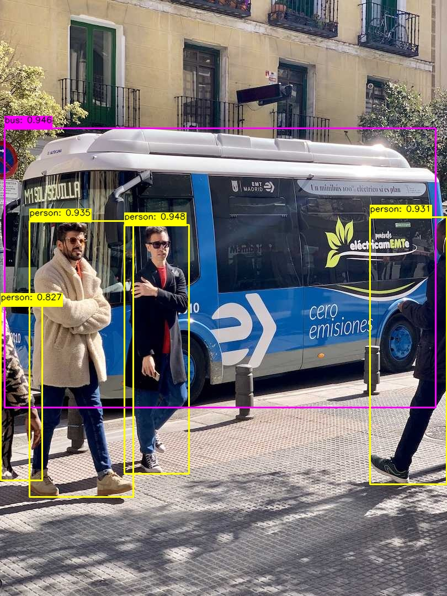
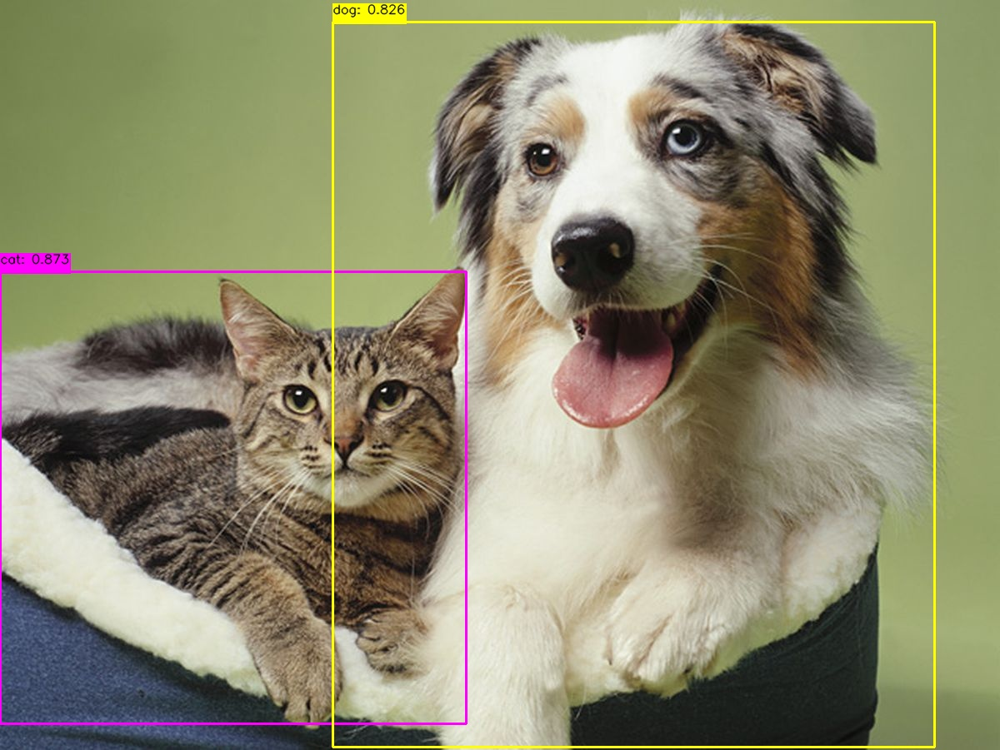

## yole onnxruntime推理
### 模型导出onnx

#### mobileclip 导出onnx
```
  python3  mobile_clip_onnx_export.py --mobile_clip_path /Users/Download/yoloe-main_0320/mobileclip_blt.pt

```
#### yoloe 导出onnx

```
  python3 export.py --yoloe_model_path /Users/Download/yoloe-v8m-seg.pt

```

### yoloe 模型推理
text prompt input
```
  python yoloe_onnx_infer.py --mobile_clip_onnx_path  /Users/Download/mobileclip.onnx --yoloe_onnx_path  /Users/Download/yoloe_v8m_det.onnx --img_path ultralytics/assets/cat_dog.jpeg 
  --text_prompt "cat,dog"    

```

### 推理效果图



### Follow-up support
- mask segmentation
- c++ infer


